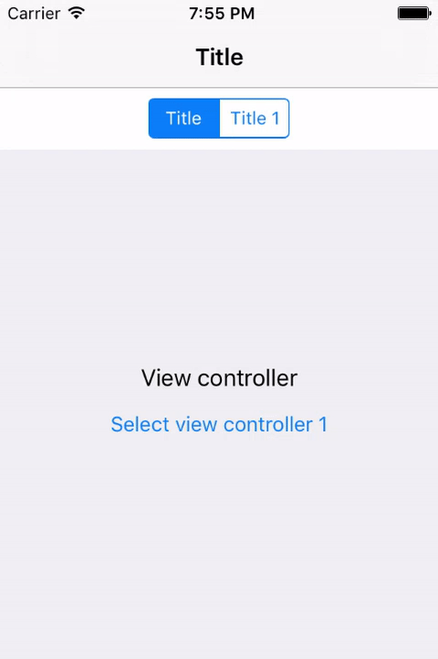
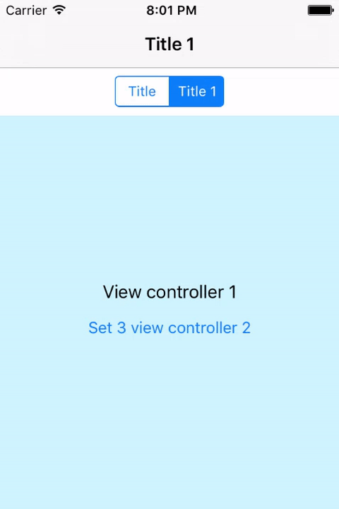

# SWSegmentedController

A container view controller with segmented control. It changes content view controller with segmented control or programmatically.


## Major features

### Select content view controller with segmented control



### Select content view controller programmatically


### Set content view controllers




## How to use

### Install

```
#import "SWSegmentedController.h"
```

### Initialize

```
SWSegmentedController *segmentedController = [[SWSegmentedController alloc] initWithControllers:@[controller, controller2]];
```

### Or initialize like

```
SWSegmentedController *segmentedController = [[SWSegmentedController alloc] init];
segmentedController.viewControllers = @[controller, controller2];
```

### Change child view controllers

```
segmentedController.viewControllers = @[controller, controller2, controller3];
```

### Get segmented control

```
UISegmentedControl *segmentedControl = segmentedController.segmentedControl;
// Do something to segmented control
```

### DO NOT change selected segment index programmatically

```
// This code changes selected index of segmented control
// dose not change content view controller
// dose not selected index of segmented controller
// It will make these 3 properties not match
segmentedControl.selectedSegmentIndex = 1;
```

### Get content view controller that displaying content

```
UIViewController *contentVC = segmentedController.contentViewController;
```

### Get content view which is the view of the selected child view controller

```
UIView *contentView = segmentedController.contentView;
```

### Get selected index indicating the selected child view controller (content view controller)

```
NSInteger selectedIndex = segmentedController.selectedIndex;
```

### Set selected index to change content view controller

```
segmentedController.selectedIndex = anIndex;
```

### Get segmented controller of child view controller

```
SWSegmentedController *segmentedController = controller.segmentedController;
```

